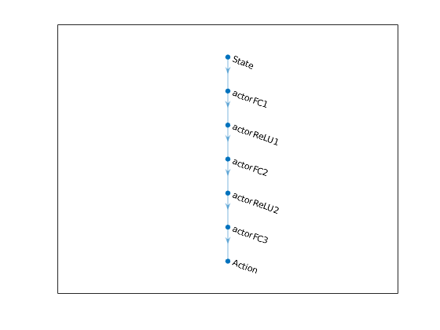

# Mobile Robot Collision Avoidance using DDPG

In this project, I use Deep Deterministic Policy Gradient (DDPG) to train multiple mobile robots to avoid the obstacle. Given the range sensor readings (states) that detect obstacles in the map, robots learn a policy to control linear and angular velocity (actions) to avoid the colliding into obstacle.

## Simulation Model

The Simulink model is shown in figure below. This is a standard reinforcement learning setup consisting of agents interacting with envrionment in discrete timestep. At each time step t, the agents take action based on the observation. As a consequence of the action, the agents receive reward and find themself in new states.


In more details, in each agent we define the training networks using the specified deep neural network , i.e., actor and critic shown in figures below.




The state is defined as a vector of 7 continuous variables ranging from 0 to 12. The action is defined as a vector of 2 continous variables ranging from -0.3 to 0.3.

In the simulation envrionment below, we define the reward function and the transition function. 


Given the action returned by the policy, the differential-drive mobile robot model `differentialDriveKinematics` produces the current pose, which is sent to the `rangeSensor` function. Then the sensor readings are sent to robot. This part of model works as the transition function in MDP. 

In order to make robot avoid the obstacle, a reward function is defined as

$$
R = \alpha d^2 + \beta v^2 + \lambda w^2
$$

where $$d$$ refers to the minimum distance to the obstacle obtained from the sensor reading, $$v$$ and $$w$$ denote the linear and angular velocity. $$\alpha$$ and $$\beta$$ are positive coefficient. $$\lambda$$ is negative to avoid robot rotating at same location.

In addition to the transition function and reward function, a contact-check module is used to detect if any of robots colliding with obstacle. If the collision happens, the current episode terminates.

## Training results

The object of the training in this project is to enable mobile robots to avoid the obstacle. So the robots are supposed to move randomly without collision until the sample time end (which is defined to be 1000 time step). As shown in figures below, the performance of mobile robot is getting better, and the episode reward and elapsed time increase.


## Running

To run the simulation, first create the variables used in the agent and environment, e.g., robot parameters, range sensor parameters. Type following command in command window.
`createEnvMulti`

Then set up training parameters like sample time, discount factor, minibatch size, and perform training.  
`trainAgentMulti`

After the training, performance simulation with the trianed robots and visualize the results.

```
out= sim('MultiMobileRobotObstacleAvoidance.slx');
showResults;
```

A trained agent is included in the repository. To see the result without training:  
`trainedAgentDemo`